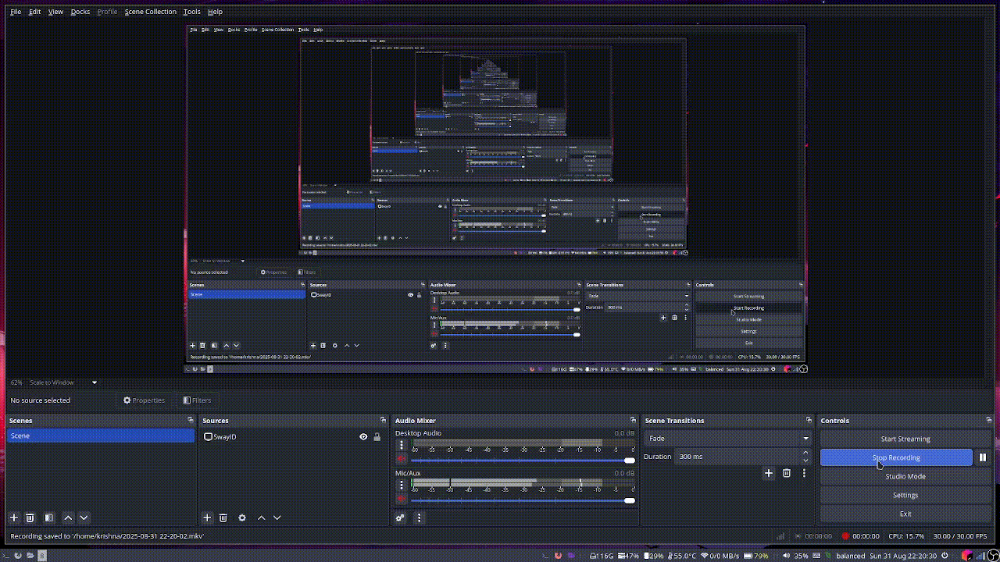

# Local Git Stats

A command-line tool written in Go that scans local Git repositories and displays commit statistics in a GitHub-style contribution graph format.

## Features

- **Repository Discovery**: Recursively scans directories to find Git repositories
- **Commit Analysis**: Analyzes commit history for a specific email address
- **Visual Statistics**: Displays commits in a colorful grid similar to GitHub's contribution graph
- **Repository Management**: Track and clear repository lists

## Installation

### Prerequisites

- Go 1.24.3 or later
- Git repositories on your local machine

### Build from Source

1. Clone the repository:
```bash
git clone <repository-url>
cd localgitstats
```

2. Install dependencies:
```bash
go mod tidy
```

3. Build the project:
```bash
go build -o localgitstats .
```

### Install Globally

To make the `localgitstats` command available globally on Linux:

1. **Build the binary:**
```bash
go build -o localgitstats .
```

2. **Move to a directory in your PATH:**
```bash
sudo mv localgitstats /usr/local/bin/
```

3. **Make it executable (if needed):**
```bash
sudo chmod +x /usr/local/bin/localgitstats
```

4. **Verify installation:**
```bash
localgitstats --help
```

Alternatively, you can install directly using Go:
```bash
go install .
```
Make sure `$GOPATH/bin` or `$HOME/go/bin` is in your PATH.

## Usage

### Add Repositories to Track

Scan a directory and add all Git repositories found:
```bash
localgitstats --add /path/to/your/projects
```

Example:
```bash
localgitstats --add ~/Development
```

### View Commit Statistics

Display commit statistics for your email:
```bash
localgitstats --email your.email@example.com
```

### Clear Tracked Repositories

Remove all tracked repositories:
```bash
localgitstats --clear true
```

## How It Works

1. **Repository Scanning**: The tool recursively searches the specified directory for `.git` folders
2. **Storage**: Found repositories are stored in `~/.localgitstats` file
3. **Commit Analysis**: When generating stats, it reads all tracked repositories and analyzes commits for the specified email
4. **Visualization**: Displays a 6-month commit history in a colorful grid format

## Configuration

The tool stores tracked repositories in a hidden file at `~/.localgitstats`. This file contains one repository path per line.

## Development

### Project Structure

```
localgitstats/
├── main.go                 # Entry point and CLI handling
├── internal/
│   ├── scan/
│   │   └── scan.go        # Repository discovery logic
│   ├── stats/
│   │   └── stats.go       # Statistics generation and display
│   └── utils/
│       └── utils.go       # File operations and utilities
├── .vscode/
│   └── launch.json        # VS Code debug configurations
├── go.mod                 # Go module definition
├── go.sum                 # Dependency checksums
└── README.md             # This file
```

The colors represent different commit frequencies:
- Gray: No commits
- Light: 1-4 commits
- Medium: 5-9 commits  
- Dark: 10+ commits
- Purple: Today's commits

## Troubleshooting

### Common Issues

1. **Permission denied**: Ensure the binary has execute permissions
2. **Command not found**: Verify the installation directory is in your PATH
3. **No repositories found**: Check that the scan path contains Git repositories
4. **No commits shown**: Verify the email address matches your Git configuration

### Check Git Configuration

Verify your Git email configuration:
```bash
git config --global user.email
```

### Checkout the Demo!!
